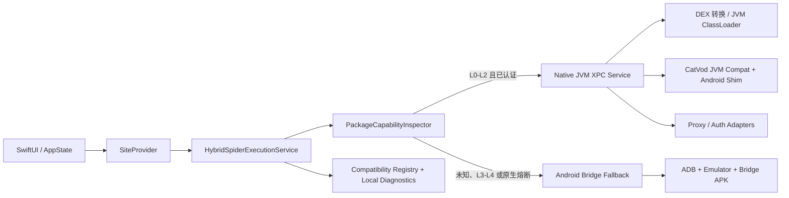

# Java/Dex 原生兼容执行服务迁移计划

- 状态：Approved for execution
- 基线版本：OKVideoMac 0.2.5（build 7）
- 目标平台：macOS 12+，Apple Silicon
- 计划日期：2026-07-31
- 总原则：原生优先、能力判定、会话锁定、自动回退、逐项验收，任何阶段都不牺牲现有正式版功能。

## 1. 目标与成功定义

本项目分两个目标，不把它们混为一谈：

1. 建立 macOS 原生的 JVM/Dex 兼容执行服务，逐步接管 Java/Dex Spider。
2. 在所有现用能力通过原生实现验收后，删除运行时对 Android SDK、ADB、模拟器和 APK 的依赖。

“迁移成功”必须同时满足：

- 首页、分类、筛选、详情、搜索、播放、Spider 代理、网盘授权等现有功能没有回退性缺陷；
- 同一个站点的一次用户会话只使用一个执行引擎，避免原生和 Android 的 Cookie、缓存、Token 状态混用；
- 原生执行结果与 Android 基准结果达到本文定义的相等标准；
- 原生引擎失败时，正式版能在用户无感或有明确提示的情况下回退；
- 连续 30 天的实际使用记录中，当前配置没有发生 Android 回退；
- App 包和运行时中不再引用 `/Volumes/XcodeDev/AndroidSDK`、`ANDROID_SDK_ROOT`、ADB、AVD、Android Emulator 或桥接 APK；
- Release 打包门禁自动阻止 Android 依赖重新进入正式包。

## 2. 已核实的当前依赖边界

### 2.1 不依赖 Android 的功能

- SwiftUI/AppKit 界面；
- 配置导入、解析和本地保存；
- type 0/1/4 标准站点；
- QuickJS JavaScript Spider；
- 多站搜索、详情和播放状态机；
- libmpv 播放器；
- M3U/TXT/JSON 直播和 XMLTV；
- 收藏、历史、设置、SQLite；
- WKWebView 嗅探和海报缓存。

### 2.2 当前依赖 Android 的功能

调用入口位于 `Engines/Spider/JavaScriptSpiderSiteProvider.swift` 中的
`AndroidDexSpiderSiteProvider`、`AndroidDexBridgeClient` 和
`AndroidDexBridgeRuntime`。

Android Bridge 当前承担：

- 下载、MD5 校验和缓存远程 Spider 包；
- 通过 `DexClassLoader` 加载 `classes.dex`；
- 创建 `com.github.catvod.spider.*` 实例并注入 Android `Context`；
- 执行 `home`、`homeVod`、`category`、`detail`、`search`、`play`、
  `action`，Bridge 内还支持 `live`；
- 执行 Spider 静态 `proxy(Map)` 并向播放器流式转发响应；
- 提供 Android `SharedPreferences`、文件目录、设备信息和网络库；
- 承载部分网盘登录 UI、截图、按钮操作和 Cookie/Token 提交；
- 保存只存在于 Android 应用数据中的网盘会话状态。

### 2.3 当前实际插件样本审计

当前启用配置共有 49 个站点，其中 46 个是 `csp_` Java/Dex 站点，并共用：

```text
MD5 1a95a36f4c42226187f9df4d97090f38
```

样本内容包括：

```text
classes.dex
assets/ftyguard_v7.so
assets/ftyguard_v8.so
assets/ftyshinidie.guard
```

静态审计确认：

- `ftyguard_v8.so` 是 Android/Linux ARM64 ELF，不是 macOS Mach-O；
- `.so` 依赖 `liblog.so`、`libandroid.so` 和 Android `libc.so`；
- `DexNative` 通过 `System.load` 加载该 `.so`；
- `getLoader`、`getSpider`、`proxyInvoke`、加解密和签名能力由 JNI 实现；
- `Init` 依赖 `android.app.Application`、`Context` 和
  `dalvik.system.DexClassLoader`；
- 实际 Spider 很可能在受保护资源中由 JNI 动态解出，静态 `classes.dex`
  只暴露入口类。

结论：这个样本不能仅靠 Dex-to-JAR 和少量 Android API 桩直接移植。它在完成以下
任一条件前必须走 Android 回退：

1. 插件提供方提供 JVM 纯 Java 包；
2. 插件提供方提供签名的 macOS ARM64 JNI 动态库及兼容加载方式；
3. 在许可允许的前提下，相关站点能力被独立、原生地重新实现并通过等价验收；
4. 用户切换到功能等价且可原生执行的配置源。

这不是计划失败，而是能力路由必须识别的 `L4` 插件类型。

## 3. 目标架构



### 3.1 统一协议

新增与 Android 无关的 `SpiderExecutionService`：

```swift
protocol SpiderExecutionService {
    func inspect(package: SpiderPackage) async throws -> SpiderCapabilityReport
    func openSession(site: SiteDescriptor) async throws -> SpiderSessionID
    func invoke(
        session: SpiderSessionID,
        method: SpiderMethod,
        arguments: [JSONValue]
    ) async throws -> JSONValue
    func proxy(session: SpiderSessionID, request: ProxyRequest)
        async throws -> ProxyResponse
    func authorizationState(session: SpiderSessionID)
        async throws -> AuthorizationState
    func closeSession(_ session: SpiderSessionID) async
}
```

现有 Android Client 先实现该协议，行为保持不变。原生 JVM 服务随后实现同一协议。
UI、搜索和播放代码不再知道 Android、ADB 或本机端口。

### 3.2 原生服务进程

采用 App 内置 XPC Service 作为不可信插件的进程边界：

- XPC 负责按需启动、崩溃隔离、调用超时和最小权限；
- XPC Service 通过 JNI Invocation API 启动 App 内置的精简 OpenJDK JVM；
- Java 侧只暴露固定 JSON/DTO 入口，不允许任意 Shell；
- 每个 Spider 包使用独立 ClassLoader，每个站点使用独立 Session；
- 插件崩溃、死循环、OOM 或 JVM 崩溃只终止 XPC Service，不终止主 App；
- XPC 重启后 Session 明确失效，由上层重新建会话或回退；
- 首期 JVM 最大堆设为 256 MiB，单调用默认 30 秒，播放解析 65 秒；
- 下载包上限沿用 16 MiB，RPC 消息上限沿用 8 MiB；
- 插件包只允许 HTTP/HTTPS，按 SHA-256 缓存；MD5 仅用于兼容上游校验。

OpenJDK 的 Invocation API 明确支持从原生进程创建 JVM；`jlink`/`jpackage`
支持生成包含必要模块的自包含运行时。采用哪个 JDK 发行版必须在引入前完成
许可证、macOS 12 和 Apple Silicon 验证。

### 3.3 能力等级

| 等级 | 包特征 | 原生策略 | 初始路由 |
|---|---|---|---|
| L0 | 标准 JVM `.class` JAR，无 Android 引用 | 直接 ClassLoader | 原生候选 |
| L1 | DEX，无 Android/JNI 引用 | DEX 转 JVM bytecode | 原生候选 |
| L2 | DEX，使用已实现的 Android Shim | 转换后加载 Shim | 认证后原生 |
| L3 | 依赖 Android UI、系统服务、账号存储 | 用 macOS 适配器替换 | 完成专项适配前回退 |
| L4 | Android ELF `.so`、JNI 解壳、动态 Dex、未知保护 | 需供应方支持或功能重写 | 强制 Android 回退 |

路由不能只看文件扩展名，必须扫描：

- DEX 版本和多 Dex；
- 引用的包、类、方法和字段；
- `native` 方法、`System.load*`、`JNI_OnLoad`；
- `assets/*.so`、ELF/Mach-O 架构；
- 反射、动态 ClassLoader 和资源解密入口；
- 需要的 Android API 是否在已认证 Shim 清单内；
- 包哈希是否已进入兼容登记表。

### 3.4 路由与回退规则

- 默认模式：`automatic`；另提供仅用于诊断的 `nativeOnly` 和
  `androidOnly`。
- 同一站点从 `home/search` 到 `detail/play/proxy/auth` 的完整 Session
  固定到同一引擎。
- 只在“尚未产生外部状态”或操作可安全重试时自动回退。
- 登录提交、收藏写入等非幂等操作不得在两个引擎自动重复执行。
- 已认证包按“包 SHA-256 + App 版本 + JVM 服务版本”登记，包变化后重新认证。
- 原生出现崩溃、超时、验证错误或结果结构错误时熔断；当前 Session 改走
  Android，新 Session 在冷却期结束前继续回退。
- 不允许用 Android 空结果覆盖原生正常结果，也不允许把上游业务空结果误判为
  引擎故障。

## 4. 分阶段开发计划

下面的时间是单开发者工程日；总量约 70–90 工程日，建议按 14–18 周规划，
另加至少 30 天正式使用观察期。第三方 L4 插件的供应方协调时间不计入工程日。

### 阶段 0：冻结基线与兼容语料库（5–7 日）

任务：

- 将 0.2.5 Android Bridge 定义为 Oracle 基准执行器；
- 建立脱敏的 Spider 包样本库，至少覆盖 10 个包、50 个站点；
- 自动记录每个站点的 `home/homeVod/category/detail/search/play/proxy`
  请求、耗时、结果形状和错误类型；
- 为网盘授权建立人工测试脚本，不保存真实 Cookie/Token；
- 实现静态包审计工具，输出 L0–L4 报告；
- 建立站点能力矩阵和已知失败登记表；
- 更新当前已经过期的 `MIGRATION_STATUS.md` 和 `COMPATIBILITY.md`。

验收门槛：

- 当前 46 个 `csp_` 站点全部生成能力报告；
- 至少 20 个可用站点完成 Android 基线回放；
- 基线脚本连续运行 3 次，非上游波动项目结果一致；
- 任何诊断文件不包含 Cookie、Token、Authorization 或完整敏感 URL。

回滚：本阶段不改运行路径。

### 阶段 1：抽象执行层并接入双引擎路由（5–7 日）

任务：

- 新增 `SpiderExecutionService`、`SpiderSession`、统一错误类型和 DTO；
- 将 `AndroidDexBridgeClient` 改造成协议实现；
- 新增 `HybridSpiderExecutionService`，首版仍 100% 路由 Android；
- 将授权 UI 从 `AndroidBridgeUIState` 重命名/映射为通用
  `AuthorizationState`；
- 移除 `AppState`、`RootView` 对 Android 类型的直接依赖；
- 加入 Session 引擎锁定、超时、熔断和回退原因记录；
- 保留旧 Client 适配层一个版本，便于立即回滚。

验收门槛：

- Swift Core/App 测试全部通过；
- 当前配置的功能和 0.2.5 完全一致；
- Release 包仍使用正式 APK，且没有 Debug 产物；
- 所有 Android 调用只存在于 Android 执行器目录。

回滚：通过一个构建开关恢复旧 Provider 直连路径。

### 阶段 2：原生 JVM XPC 服务 MVP（8–12 日）

任务：

- 新增 `JVMSpiderService.xpc` 和 JNI Host；
- 生成并签名 Apple Silicon 精简 JRE；
- 实现 XPC 生命周期、健康检查、版本协商、取消和崩溃恢复；
- Java 侧实现统一 RPC 入口、站点 Session 和 ClassLoader 隔离；
- 先支持 L0 纯 JVM CatVod 测试 Spider；
- 接入 Gson、OkHttp JVM、Brotli、ZXing 等经过许可证审计的依赖；
- 验证 Hardened Runtime、签名、公证预检和 macOS 12 启动。

验收门槛：

- 测试 JAR 的全部 Spider 方法与 Android Oracle 结果等价；
- XPC/JVM 连续崩溃 100 次不导致主 App 崩溃；
- 单调用超时后无泄漏任务；重启后可恢复；
- Release 包在未安装系统 Java 的干净账户中可运行；
- App 验证脚本检查 JRE 版本、架构、签名和许可证。

回滚：`HybridSpiderExecutionService` 将所有正式站点继续路由 Android。

### 阶段 3：DEX 转换和 Android 兼容层（12–18 日）

任务：

- 集成 dex2jar 的库级转换能力，并固定源码版本和 SHA-256；
- 对转换结果运行 JVM 字节码验证，转换告警一律不自动进入原生；
- Enjarify 仅作为离线对照工具，不放进正式运行时；它目前只支持 DEX 035，
  不适合作为现代 DEX 的生产回退；
- 实现最小 Android Shim：
  - `Context/Application/Resources/ApplicationInfo` 的必要子集；
  - `SharedPreferences`；
  - `Uri`、`TextUtils`、`Base64`、`Log`、`Build`；
  - App 专属缓存/文件目录；
  - 可审计的 HTTP、Cookie、DNS 和代理适配；
- 构建 JVM 版本 `catvod-core`，用 JVM 依赖替换 AndroidX 依赖；
- 对反射调用和重载解析做契约测试；
- 每增加一个 Shim API，必须有真实样本测试，不做大而全的 Android 克隆。

验收门槛：

- L0/L1 样本通过率 100%；
- 已声明支持的 L2 样本通过率至少 95%，其余明确回退；
- 所有原生通过样本的搜索、详情和播放字段等价率 100%；
- P95 调用耗时不高于 Android Bridge 的 80%；
- 无 `VerifyError`、ClassLoader 泄漏和跨站静态状态污染。

回滚：按包哈希撤销原生资格，无需发布新 App。

### 阶段 4：Proxy、缓存和持久化等价（6–9 日）

任务：

- 实现 JVM `proxy(Map)` 和流式响应；
- 支持状态码、MIME、Header、HEAD、Range、分块传输和取消；
- 统一 Android `127.0.0.1:-1/proxy` 与 Mac 可达 URL 的映射；
- 将原生站点的 Cookie/偏好写入站点隔离存储；
- 敏感凭据写入 Keychain，普通偏好写入 Application Support；
- 原生与 Android 数据目录严格隔离，禁止隐式复制凭据；
- 对 M3U8 代理、字幕、Range seek 和长时间播放做压力测试。

验收门槛：

- 2 小时连续代理播放无泄漏、卡死和主 App 崩溃；
- 拖动进度、断线重连和字幕加载与 Android 基准一致；
- 日志和诊断中无凭据；
- 原生失败时能重新解析并切换到 Android Session。

### 阶段 5：网盘授权原生化（12–20 日）

先抽象 `CloudAuthorizationService`，再逐个适配，不把所有网盘绑在一个大改动里。

建议顺序：

1. 粘贴 Cookie/Token 的通用流程；
2. 夸克和 UC；
3. 阿里；
4. 百度；
5. Bilibili；
6. 需要插件私有扫码 UI 的其他服务。

每个适配包含：

- WKWebView 或供应方允许的授权入口；
- 授权状态轮询和过期检测；
- Keychain 存储、清除和重新授权；
- 播放所需 Cookie/Header/Token 注入；
- 取消、超时、二维码过期和网络异常；
- 不采集、不上传凭据；
- Android 授权继续作为该 Provider 的回退。

验收门槛：

- 每个 Provider 单独通过登录、退出、过期、重登和播放测试后才开启原生；
- 同一账号连续 7 天使用没有丢失会话；
- 失败不会覆盖 Android 中仍有效的会话；
- 百度等上游扫码规则变化时，只影响对应适配器。

### 阶段 6：Native-first 灰度和稳定观察（10–15 日 + 30 日观察）

任务：

- 新增设置页诊断：包等级、当前引擎、回退原因、耗时、上次成功；
- 先对白名单 L0/L1 开启，再按包哈希逐步扩大 L2；
- 对同一个安全、幂等请求进行采样双跑，只向用户返回主引擎结果；
- 对结果做结构化差异比较，不比较时间戳和随机字段；
- 建立本地兼容登记表，默认不上传诊断数据；
- 每次版本升级执行完整语料库回归；
- 连续观察原生崩溃率、超时率、回退率和播放成功率。

发布门槛：

- 原生服务崩溃率低于 0.1% 调用；
- 原生非上游超时率低于 0.5% 调用；
- 已认证包的结果不一致率为 0；
- 搜索到首批结果不慢于现有 0.2.5；
- 连续 30 天没有当前配置所需的 Android 回退。

### 阶段 7：删除 Android SDK 依赖（5–8 日）

只有满足退出条件后执行：

- 删除 `AndroidDexBridgeRuntime`、ADB/AVD/Emulator 启动代码；
- 删除 APK 构建、嵌入、安装和端口转发；
- 删除 `Helpers/AndroidDexBridge` 的产品构建依赖，可保留在历史分支；
- 打包脚本不再调用 Gradle 或读取 `ANDROID_SDK_ROOT`；
- `verify-bundle.sh` 反向检查 App 内不得出现 APK、ADB、Android Emulator；
- 清理设置和诊断中的 Android 文案；
- 提供旧模拟器数据清理说明，不自动删除用户数据；
- 运行全量测试、干净机安装、签名和正式包验收。

硬性退出条件：

- 当前实际使用的每个 `csp_` 站点已原生认证，或已被功能等价配置替代；
- 当前受保护 `ftyguard` L4 插件已获得可移植版本或不再是功能依赖；
- 网盘授权全部原生通过；
- 30 天观察期回退次数为 0；
- 保留上一个含 Android 回退的正式包至少一个发布周期，便于紧急降级。

如果 L4 条件没有解决，只能删除“外部安装 SDK 的要求”，不能诚实地宣称已经
完全删除 Android 运行能力。

## 5. 等价判定与测试体系

### 5.1 结果等价

对 JSON 结果先标准化再比较：

- 对对象 key 排序；
- URL 只规范化无语义差异的编码，不删除签名参数；
- 忽略明确列入白名单的随机 ID、时间戳和广告字段；
- 首页分类、筛选、视频 ID、线路、分集、播放 URL、Header 和字幕必须逐项比较；
- 空数组、空字符串和 `null` 不默认视为相同；
- Android 成功而原生为空，视为原生失败；
- 两边都失败时按错误类型区分上游失败和运行时失败。

### 5.2 测试层级

1. 单元测试：能力扫描、DTO、ClassLoader、Shim、路由、熔断。
2. 契约测试：同一 fixture 在 Android 与 JVM 执行，比较标准化结果。
3. 真实包回归：固定哈希包和脱敏输入。
4. 故障注入：断网、慢响应、损坏 Dex、错误 MD5、JVM OOM、XPC 崩溃。
5. 播放测试：直链、JSON 解析、代理 M3U8、Range、字幕、授权过期。
6. Release 验证：签名、Hardened Runtime、正式资源、无 Debug 产物。
7. 干净机测试：无 Android SDK、无系统 Java、无旧缓存。

### 5.3 必须持续监控的指标

- `native_eligible_rate`
- `native_success_rate`
- `fallback_rate`
- `result_mismatch_rate`
- `service_crash_rate`
- `invoke_timeout_rate`
- `search_time_to_first_result`
- `play_resolution_success_rate`
- 每个包哈希和方法的 P50/P95 耗时

这些指标先只写入本地脱敏诊断；没有用户明确同意不得上传。

## 6. 风险与处理

| 风险 | 影响 | 控制措施 |
|---|---|---|
| Android JNI/ELF 不能在 macOS JVM 加载 | 当前主插件无法原生运行 | L4 强制回退；供应方版本、合法重写或替换配置三选一 |
| Dex 转换器产生错误字节码 | 隐性数据错误或崩溃 | JVM verifier、Oracle 双跑、包哈希白名单 |
| Android API 面过大 | 工期失控 | 只按真实语料实现最小 Shim，未知 API 回退 |
| 插件静态状态污染 | 跨站 Cookie/实例串扰 | 包级 ClassLoader、站点级 Session、XPC 重启 |
| 原生和 Android 凭据不同步 | 登录或播放失败 | Session 锁定；Keychain 独立；迁移期不自动覆盖 |
| 动态插件执行不可信代码 | 文件/隐私风险 | XPC 进程隔离、最小权限、固定 RPC、无 Shell、资源限制 |
| 上游频繁换包 | 兼容资格失效 | 按 SHA-256 认证，变化后先回退再重新验证 |
| 误把上游故障当原生故障 | 无意义回退 | 结构化错误分类、双边探测和冷却熔断 |
| 正式包混入 Debug 组件 | 发布质量事故 | Release 验证脚本检查所有可执行文件和嵌入资源 |

## 7. 人力、时间和里程碑

| 里程碑 | 累计时间 | 可交付结果 |
|---|---:|---|
| M0 基线完成 | 第 1–2 周 | 语料库、能力报告、Android Oracle |
| M1 双引擎骨架 | 第 3 周 | 现有功能不变，可路由和回退 |
| M2 JVM L0 可用 | 第 5 周 | 纯 JVM Spider 原生运行 |
| M3 L1/L2 可用 | 第 8–9 周 | 普通 DEX 和常用 Android API |
| M4 Proxy 等价 | 第 10 周 | 可完成原生播放 |
| M5 网盘原生化 | 第 13–15 周 | 逐 Provider 脱离 Android UI |
| M6 Native-first | 第 16–18 周 | 白名单原生优先，稳定观察 |
| M7 删除 SDK | 观察期后 | 满足硬门槛后移除 Android |

建议至少由一名主开发负责架构和 Swift/JNI，另安排测试资源维护真实站点语料。
如果只有一人，必须保持阶段门禁，不用压缩观察期换速度。

## 8. 第一批可直接执行的任务

按以下顺序开始，不需要修改 UI：

1. 新建 `SpiderExecutionService` 和通用 DTO；
2. 给现有 Android Client 增加协议适配器；
3. 新建 `PackageCapabilityInspector`，先支持 ZIP/DEX/ELF/JNI/Android 引用扫描；
4. 新建 `CompatibilityRegistry`，以包 SHA-256 为主键；
5. 建立 Android Oracle 录制器和结果标准化器；
6. 添加 `HybridSpiderExecutionService`，初始路由保持 100% Android；
7. 添加 Session 引擎锁定和回退原因；
8. 完成阶段 1 的全部回归后，再创建 JVM XPC target。

第一批提交不得：

- 删除 Android Bridge；
- 改变当前正式包的默认执行引擎；
- 把未经认证的包自动送进 JVM；
- 自动迁移或清除任何网盘凭据；
- 把 Debug APK 或 Debug JVM Helper 打入正式包。

## 9. 决策记录

采用 XPC + 内嵌 JVM，而不是在主 App 进程直接加载插件，原因是第三方 Spider
可能崩溃、死循环或加载 JNI。Apple 的 XPC 文档明确把插件稳定性和权限隔离列为
XPC 的主要使用场景；Oracle 的 JNI Invocation API 支持原生进程创建 JVM；
Android 官方文档则说明 DEX 是 ART/Dalvik 的执行格式，不能假设标准 JVM 可以
直接运行。

DEX 转换器只负责字节码格式转换，不解决 Android Framework、Android ELF/JNI、
动态解壳和业务授权问题。dex2jar 可作为生产转换候选；Enjarify 只作为离线对照，
因为其公开说明仍限制在 DEX 035。

参考：

- Android DEX 格式：
  https://source.android.com/docs/core/runtime/dex-format
- Android Runtime/ART：
  https://source.android.com/docs/core/runtime
- Oracle JNI Invocation API：
  https://docs.oracle.com/en/java/javase/21/docs/specs/jni/invocation.html
- Oracle `jlink`：
  https://docs.oracle.com/en/java/javase/21/docs/specs/man/jlink.html
- Oracle `jpackage`：
  https://docs.oracle.com/en/java/javase/21/docs/specs/man/jpackage.html
- Apple XPC Services：
  https://developer.apple.com/library/archive/documentation/MacOSX/Conceptual/BPSystemStartup/Chapters/CreatingXPCServices.html
- dex2jar：
  https://github.com/pxb1988/dex2jar
- Enjarify：
  https://github.com/Storyyeller/enjarify

