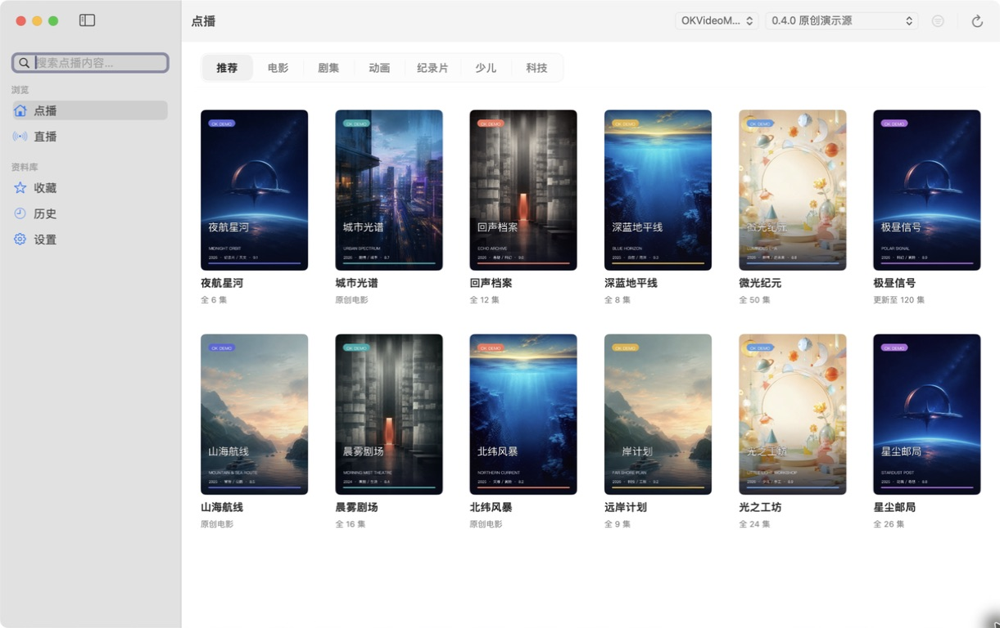
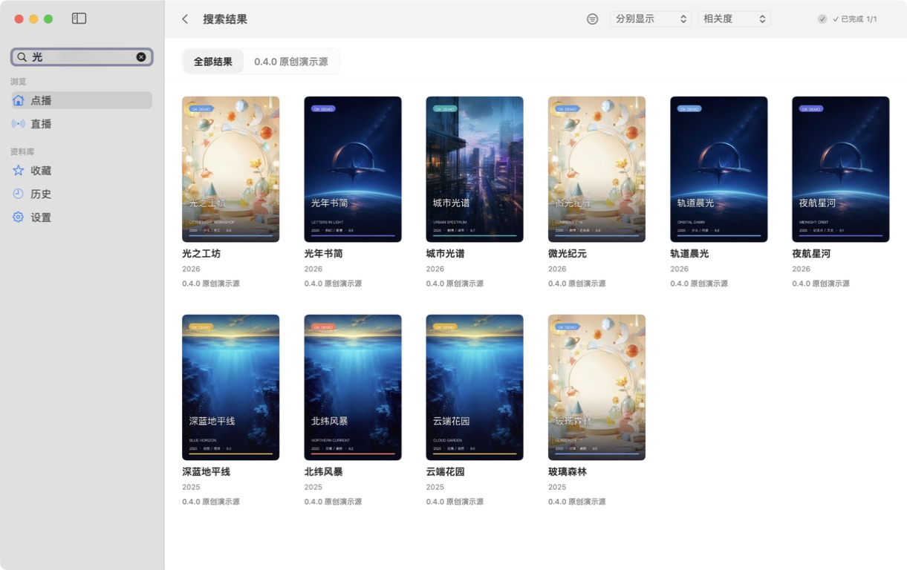
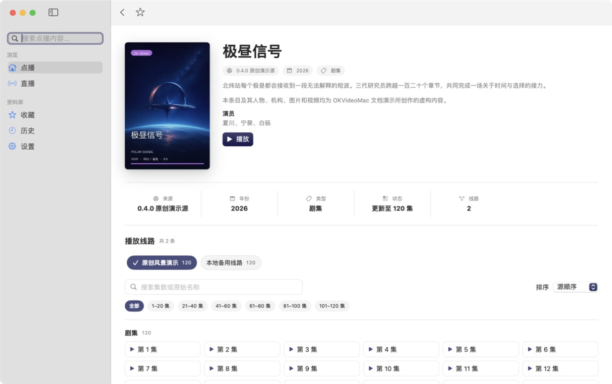
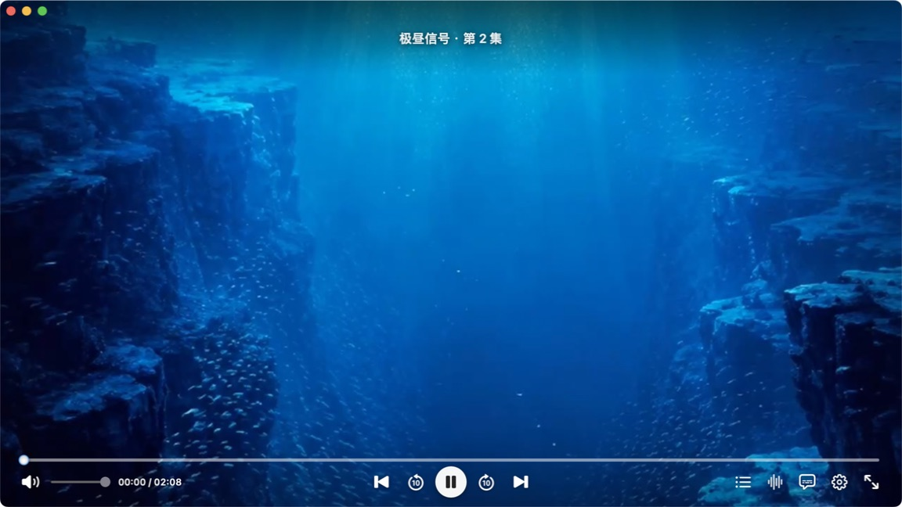
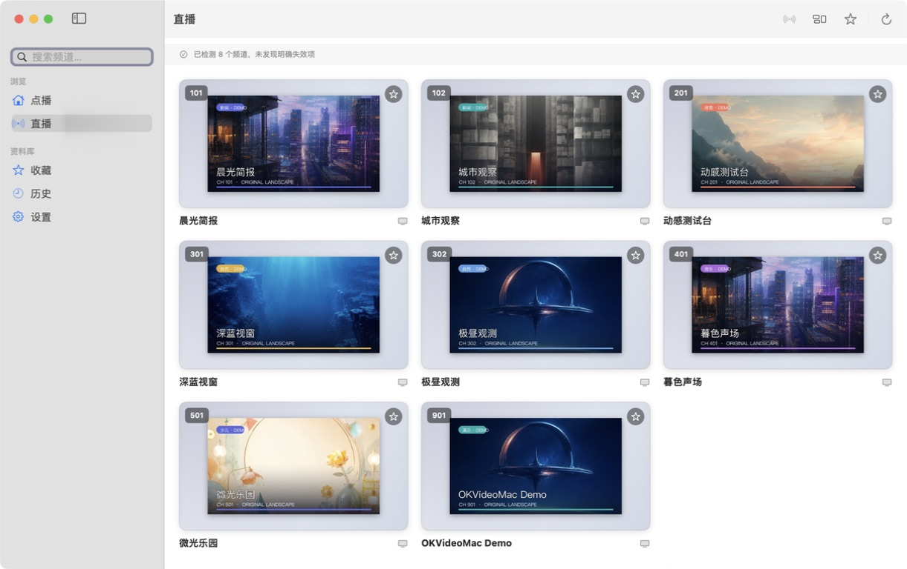
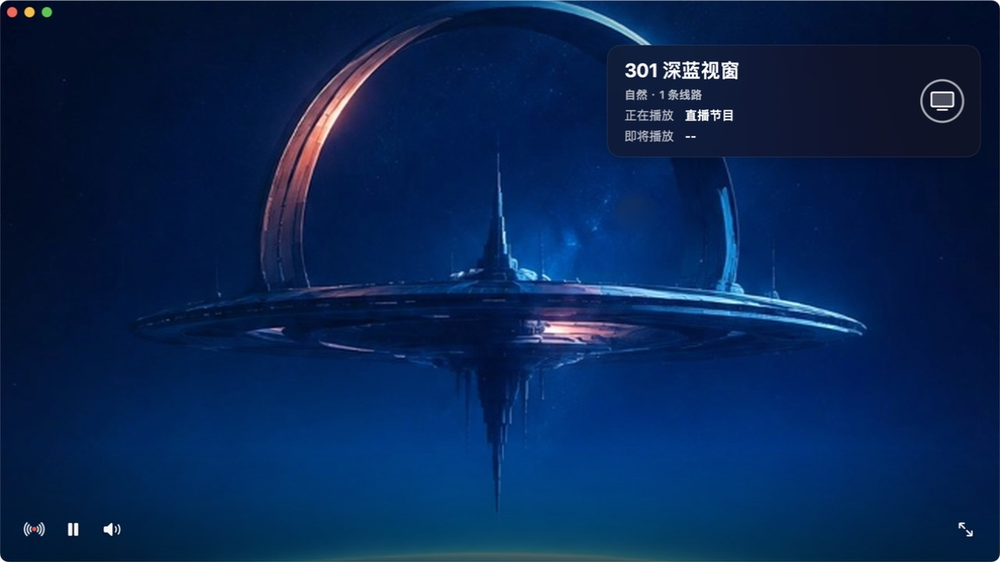
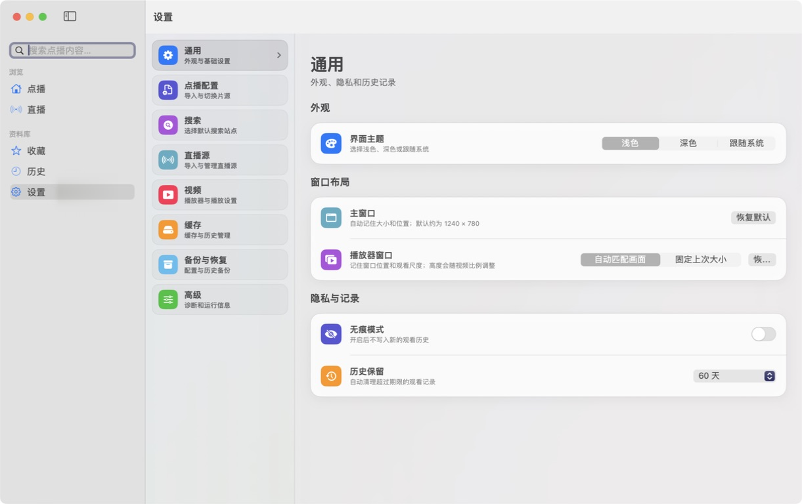

# OKVideoMac

English | [简体中文](README_zh-CN.md)

OKVideoMac is a native video and live-TV client for Apple Silicon Macs. It
provides configurable video providers, live sources, search, detail, favorites,
history, and libmpv playback. It does not bundle third-party content sources,
accounts, cookies, parsing services, or DRM keys.

The current release is **0.5.0 (Build 99)** for macOS 12 or later on Apple
Silicon (`arm64`). Download the Developer ID-signed, Apple-notarized, and
stapled DMG from the
[v0.5.0 release](https://github.com/yaolin-dev/OKVideoMac/releases/tag/v0.5.0).

## 0.5.0 Highlights

Android compatibility now has two explicit modes. **Managed Runtime** is the
recommended default: on the first real Java/Dex `csp_` request, OKVideoMac can
download and transactionally activate its pinned JRE, Android tools, Emulator,
and API 35 Google APIs arm64 image inside private Application Support storage.
**External SDK** lets existing and advanced users explicitly keep a compatible
Android SDK without being forced through a Managed download.

The selected mode is stored atomically and never changes merely because `PATH`,
`ANDROID_HOME`, Homebrew, or Android Studio exposes another SDK. Managed and
External execution remain isolated, while the private ADB server, owned AVD,
process ownership, startup single-flight, GPU fallback, and safe recovery stay
under the existing Session lifecycle. Compatibility fingerprints fail closed
without silently deleting AVD userdata.

This release also retains the ADB/offline and legacy guest-auth recovery work
developed in the 0.4.2 candidate, adopts an AppKit-native source-list sidebar,
and matches the App Store Escape sequence for search. During App Quit, visible
windows now leave the screen immediately while the owned Android Runtime keeps
its full graceful shutdown opportunity in the background; unrelated Emulators
and ADB servers are never targeted.

## 0.4.1 Highlights

Version 0.4.1 improves the optional Android compatibility Runtime used by
selected TVBox and Java/Dex Spider sources. OKVideoMac now safely adopts a
healthy private Emulator left by an earlier App session, serializes concurrent
startup requests, recovers more clearly while ADB is becoming ready, and closes
its own Runtime during normal App termination without affecting Android Studio
or other user AVDs. It retains the native macOS, playback, search, live, cloud,
and release-engineering improvements introduced in 0.4.0.

### Source Compatibility

- Native CMS JSON remains the most complete provider path; CMS XML and type 4
  have narrower, partial coverage.
- Selected TVBox/FongMi-style QuickJS scripts and CatVod/CatPaw-style Node video
  interfaces have broader support. This is not universal ecosystem compatibility.
- The optional Android Bridge supports selected Java/Dex `csp_` providers with
  stronger AVD ownership, APK version, and signature checks. Native, QuickJS,
  Node, Live, and XMLTV paths do not require Android.
- Existing healthy or still-booting OKVideoMac private runtimes are adopted;
  concurrent requests share one startup, and normal App Quit closes the private
  Runtime automatically.

### Search & Detail

- Aggregated searches isolate concurrent sources by session. Stopping a search
  preserves completed results, and late callbacks cannot overwrite a newer run.
- Back, Escape, and Command-[ share one layered action: stop an active search
  first, then return to the page from which it was opened.
- Detail requests retain configuration, site, and request identity so rapidly
  changing selections cannot be replaced by an older response.
- Long series use paged episode navigation; 120-episode and multi-line fixtures
  are part of the release validation set.

### Playback & Live TV

- Player opening, teardown, window restoration, buffering feedback, seeking,
  and natural end-of-file auto-advance are more reliable.
- Playback attempts, line switching, and automatic retries have generation
  isolation, preventing stale work from reclaiming the current player.
- Live channel lists, grouping, multi-line sources, XMLTV EPG, channel switching,
  and return navigation have been hardened.
- M3U, TXT, and JSON live lists can be imported directly; HLS is supported as a
  channel media format.

### Cloud & Authorization

- Missing or expired cloud credentials open the matching authorization page;
  successful authorization safely retries the original playback once.
- Authorization uses a real macOS window sheet with system dimming, focus,
  Escape, keyboard, and accessibility behavior.
- Quark reuses an existing transfer workspace after cookie rotation or rescanning
  by binding it to stable account identity and rediscovering invalid ledger FIDs.
- Cleanup remains limited to the exact receipt-recorded `savedFID`; it never
  scans or clears an entire cloud folder.

### Native macOS Experience

- Home, search, detail, playback, live, and settings were refined with clearer
  hierarchy, native toolbar placement, and immediate status feedback.
- Configuration and authorization moved from a custom full-window overlay to a
  system sheet, making the background consistently dimmed and non-interactive.
- Search Back remains visible during high-frequency progress updates. Controls
  and transitions use system interaction semantics and respect Reduce Motion.

### History, Backup & Safety

- Favorites, history, and playback restoration retain their originating
  configuration and site identity, avoiding cross-configuration mix-ups.
- Portable configuration and history backup/restore validate imported data and
  avoid overwriting newer active state.
- Remote Node bundles retain source/version/SHA-256 trust rules. Logs and release
  gates scan for cookies, tokens, private URLs, and machine-specific paths.

### Release & Open Source

- The user download is an Apple-notarized and stapled DMG containing only
  `OKVideoMac.app` and an Applications link. ZIP remains the verified internal
  binary identity/archive carrier.
- The DMG, ZIP, Source Release, four SPDX/CycloneDX SBOMs, notices, and Android
  Bridge APK are bound by an outer manifest and `SHA256SUMS` to one exact commit.
- Release gates verify 28 arm64 Mach-O files, minimum macOS, dependency closure,
  nested signing, Hardened Runtime, Gatekeeper, and binary/source mapping.

## The real 0.4.0 interface

Every image below was captured from the final 0.4.0 (Build 94) Release app using
the reproducible, original demo source and scenic media in this repository. No
real film, IPTV service, account, or private URL appears. Both READMEs share
this one screenshot set.

### Home

### Search

### Detail

### VOD playback

### Live channels

### Live playback

### Settings

See the [Demo Source](Docs/DemoSource/README.md) and
[screenshot manifest](Docs/Media/v0.4.0/README.md) for generation, provenance,
and capture details.

## Compatibility overview

Compatibility is determined by source format, runtime, API shape, parsing
requirements, and media behavior—not by an ecosystem brand.

| Source / runtime | Status | Notes |
| --- | --- | --- |
| Native CMS JSON | Supported | Home, categories, filters, detail, search, and play handoff |
| CMS XML / Native type 4 | Partial | Coverage is narrower than JSON |
| QuickJS Spider | Selected | Selected CatVod/FongMi-style scripts matching the current API |
| Node `.js.md5` | Selected | Compatible CatVod/CatPaw-style video-interface subset |
| Java/Dex `csp_` | Experimental | Managed API 35 Runtime or an explicitly confirmed compatible External SDK |
| M3U / TXT / JSON Live | Supported | Imported through the dedicated Live importer |
| XMLTV EPG | Supported | Android is not required |
| Top-level `lives`, parser types 2/3/4 | Unsupported | Some fields parse, but no complete execution path exists |

Read the [compatibility guide](OKVideoMac/macOS/OKVideoMac/Docs/COMPATIBILITY.md)
for precise boundaries.

## Download and install

Requirements:

- macOS 12.0 or later;
- Apple Silicon (`arm64`);
- only Java/Dex `csp_` sources need the optional Android compatibility
  component; OKVideoMac offers to download and manage it on first use.

Download `OKVideoMac-0.5.0.dmg`, open it, and drag `OKVideoMac.app` to
Applications. The official image is notarized by Apple; do not disable
Gatekeeper or SIP.

## Binary and source identity

The 0.5.0 (Build 99) assets are built from the exact commit referenced by tag
`v0.5.0`. The GitHub Release publishes `OKVideoMac-0.5.0.dmg` together with its
post-notarization `.sha256` checksum. The source tag is the public source of
truth; generated source indexes, manifests, SBOMs, notices, and checksums bind
the binary to that commit without placing a circular binary hash in the tagged
source. Two native provenance
exceptions remain explicitly disclosed rather than overstated: the exact zlib
archive is unavailable, and historical MacPorts libc++/libc++abi inputs could
not be recovered.

## Known limitations

- Apple Silicon only; no Intel or Universal Binary build is provided.
- The Java/Dex Bridge remains Experimental. Its managed API 35 profile is
  verified on one M1 / macOS 14.8.8 host; macOS 12, 13, and 15 have not yet
  received real-machine Emulator E2E verification.
- QuickJS, Node, cloud, and web-sniffing paths implement selected interfaces;
  upstream changes can require compatibility updates.
- Top-level TVBox/FongMi `lives`, catchup/timeshift, parser types 2/3/4, and DRM
  are not supported.
- A large legacy database can cause a one-time startup pause. TMDB metadata
  enhancement is deferred to a later release.

## Documentation and security

- [0.5.0 release notes](Docs/RELEASE_NOTES_0.5.0.md)
- [Detailed project documentation](OKVideoMac/README.md)
- [Compatibility guide](OKVideoMac/macOS/OKVideoMac/Docs/COMPATIBILITY.md)
- [Android Bridge Setup](OKVideoMac/macOS/OKVideoMac/Docs/ANDROID_BRIDGE_SETUP.md)
- [Build from source](OKVideoMac/macOS/OKVideoMac/Docs/BUILDING.md)
- [Source release process](Docs/SOURCE_RELEASE_PROCESS.md)
- [DMG release process](Docs/DMG_RELEASE_PROCESS.md)
- [Changelog](CHANGELOG.md)
- [Security policy](SECURITY.md)

Use only configurations and content you are authorized to access. Remove private
URLs, cookies, tokens, accounts, and personal data from issue reports. Report
security concerns privately as described in the [security policy](SECURITY.md).

## License

OKVideoMac is distributed under the [GNU General Public License v3.0](LICENSE).
Third-party components remain subject to their respective licenses and notices.
