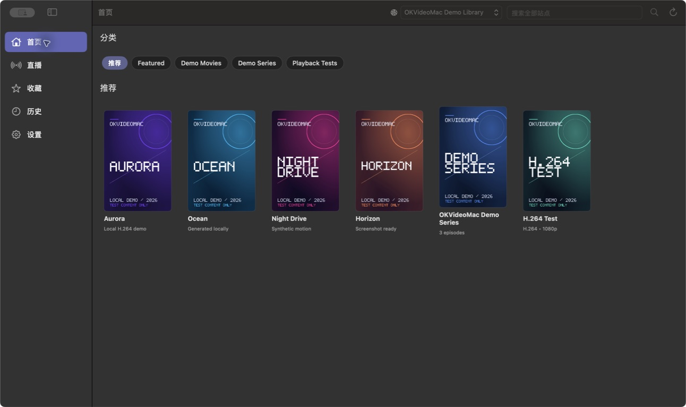
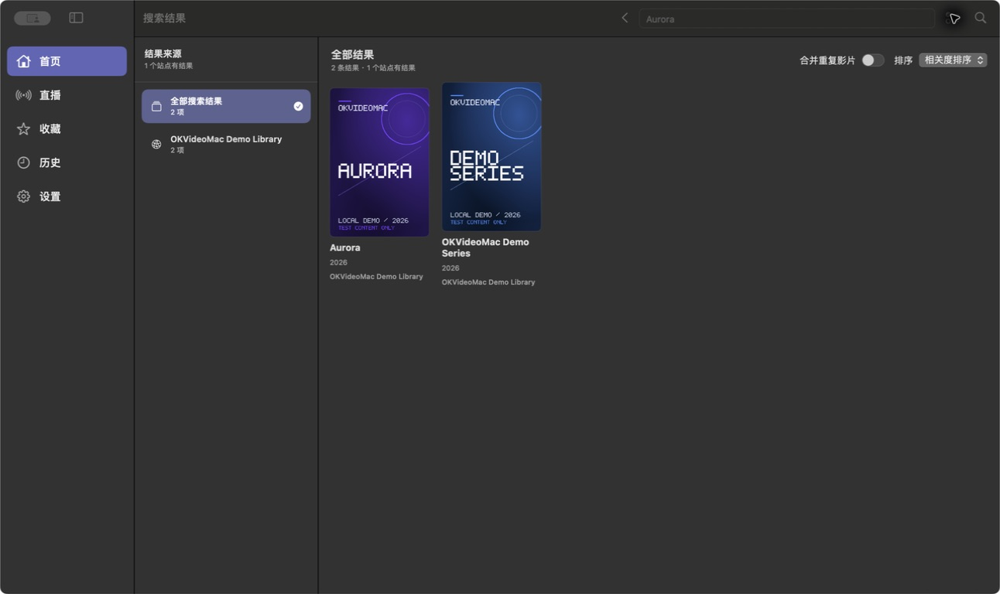
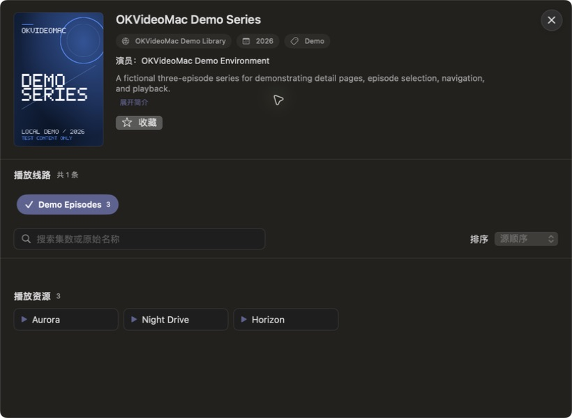
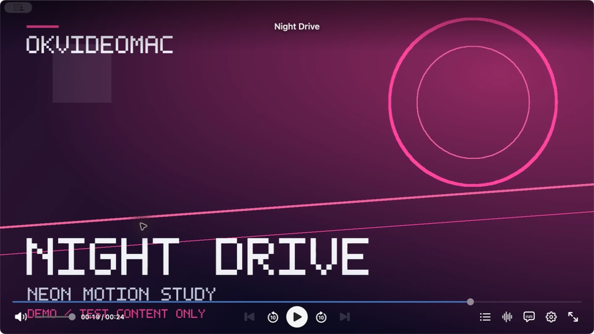
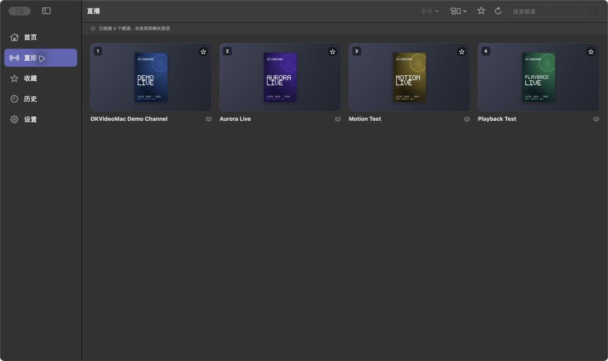

# OKVideoMac

[English](README.md) | 简体中文

OKVideoMac 是一款原生 macOS 客户端，支持可配置的视频 Provider 和直播流，
采用 SwiftUI 界面并基于 libmpv 播放。当前公开版本为面向 macOS 12 或更高版本
Apple Silicon Mac 的 **0.3.41（Build 65）**。

## 亮点

- 原生 macOS 导航、搜索、历史记录、收藏和播放界面
- 支持可配置的视频 Provider，以及 M3U、TXT 或 JSON 直播源列表
- 使用 libmpv 播放点播视频和直播流
- 支持符合当前接口的部分 QuickJS 和 CatVod/CatPaw 风格 Node 视频源
- 为部分 Java/Dex `csp_` Provider 提供可选的 Android Bridge

兼容性主要取决于源格式、站点类型、运行时、API 结构、解析要求和媒体行为，而
不是生态品牌。能够使用部分 TVBox、FongMi、MiraPlay 或 CatPawOpen 生态中的源，
并不代表对这些生态实现完整兼容。

| 源 / 运行时 | 状态 | 说明 |
| --- | --- | --- |
| Native CMS JSON | Supported | 原生 Provider 路径 |
| CMS XML 响应 | Partial | 覆盖范围窄于 JSON 路径 |
| QuickJS Spider | Selected | 符合当前接口的部分 CatVod/FongMi 风格脚本 |
| Node `.js.md5` | Selected | CatVod/CatPaw 风格 Node 视频接口的兼容子集 |
| Java/Dex `csp_` | Experimental | 需要可选 Android Bridge |
| M3U / TXT / JSON 直播 | Supported | 通过独立直播源导入器使用 |
| XMLTV EPG | Supported | 不需要 Android |

配置格式、运行时分派、解析器限制和生态边界详见
[兼容性指南](OKVideoMac/macOS/OKVideoMac/Docs/COMPATIBILITY.md)。

## 系统要求

- macOS 12 或更高版本
- Apple Silicon（`arm64`）

Native Provider、QuickJS、Node `.js.md5`、M3U/TXT/JSON 直播、XMLTV 和普通
播放均不需要 Android。只有受支持的 Java/Dex `csp_` Provider 才需要 Android。

Android Studio 是推荐的安装界面，但不是运行时依赖。需要可选 Bridge 时，
OKVideoMac 会自行创建专用 `OKVideoMac_Runtime` AVD，并自动安装随 App 提供的
Bridge APK；用户不应手工创建 AVD 或安装 APK。详见
[Android Bridge 设置](OKVideoMac/macOS/OKVideoMac/Docs/ANDROID_BRIDGE_SETUP_zh-CN.md)。

## 截图

所有截图均使用本地生成的演示媒体；项目未捆绑第三方视频源或真实 IPTV 内容，
这些截图中也未展示此类内容。

## 下载与安装

请从 [GitHub Releases](https://github.com/yaolin-dev/OKVideoMac/releases)
下载官方 DMG，打开后将 `OKVideoMac.app` 拖入“应用程序”文件夹。当前
`OKVideoMac-0.3.41-macOS-arm64.dmg` 包含 0.3.41（Build 65），已使用
Developer ID 签名并经过 Apple 公证。安装正式版本时不要关闭 Gatekeeper 或 SIP。

## 二进制与源码对应关系

当前 v0.3.41 二进制及其对应源码集均为 Build 65。源码归档、索引、manifest、
许可证、校验和、SBOM 与 binary-bound 记录都绑定到 `v0.3.41-build65` 的 exact
release commit。当前 Build 65 资产集详见
[源码发布流程](Docs/SOURCE_RELEASE_PROCESS.md)。

Build 62 和 Build 63 是更早的公开发布前候选；Build 64 保留为上一版不可变公开
发布。Build 62 的结论保留在
[Build 62 历史发布准备记录](Docs/IMMUTABLE_RELEASE_READINESS.md)中；该快照及
其他历史候选记录都不是当前 v0.3.41 的发布状态。

## 内容与配置

OKVideoMac 不内置第三方视频源、账号、Cookie、解析地址或 DRM 密钥。请仅使用
你有权访问的配置和内容。

## 文档

- [详细项目文档](OKVideoMac/README.md)
- [兼容性指南](OKVideoMac/macOS/OKVideoMac/Docs/COMPATIBILITY.md)
- [Android Bridge 设置](OKVideoMac/macOS/OKVideoMac/Docs/ANDROID_BRIDGE_SETUP_zh-CN.md)
- [从源码构建](OKVideoMac/macOS/OKVideoMac/Docs/BUILDING.md)
- [源码发布流程](Docs/SOURCE_RELEASE_PROCESS.md)
- [参与贡献](CONTRIBUTING.md)
- [安全政策](SECURITY.md)

请通过 [GitHub Issues](https://github.com/yaolin-dev/OKVideoMac/issues)
报告可复现的问题，并在提交报告前移除私人 URL、凭据、Cookie 和个人数据。

## 许可证

OKVideoMac 依据 [GNU General Public License v3.0](LICENSE) 发布。
第三方组件仍分别受其各自许可证和声明的约束。
